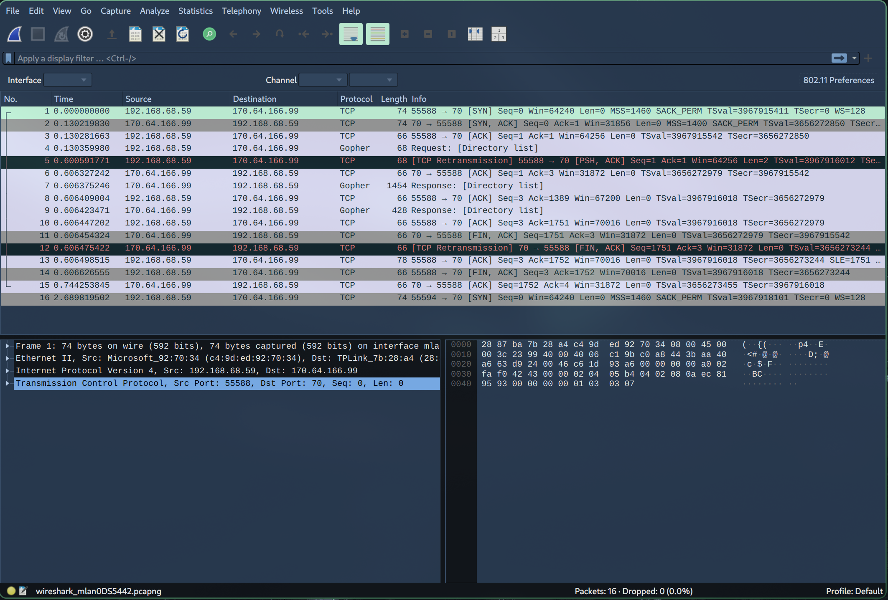

# Gopher Indexing Client Report

Name: Razeen Wasif 
UID: u7283652

## Introduction 
This report details the design, implementation, and results of a 
Gopher indexing client. The primary goal was to create a client capable 
of connecting to the `comp3310.ddns.net` gopher server, crawling its 
resources, analyzing the content found and reporting summary statistics.
To run the program simpy type the command `python gopherClient.py`.
The default host and port are `comp3310.ddns.net` and `70` respectively.
To use a different host and/or port, provide the host and port as arguments 
when running the command, e.g. `python gopherClient.py <hostname> <port>`.

## Client Design and Implementation 
The client is designed to be robust and efficient, adhering to the 
Gopher protocol specification while handling potential real-world 
deviations. 

### Core Networking:
  - Connections are established using the standard socket API 
  provided by python's core libraries.
  - TCP sockets (AF_INET, SOCK_STREAM) are created and connected to 
  the target server's IP address (resolved via DNS lookup) and port.
  - Socket timeouts are set to prevent the client from hanging indefinitely

### Gopher Protocol Handling:
  - Requests: Client requests are formatted as `selector\r\n` as specified 
  in RFC 1436. An empty selector (`\r\n`) is sent to retrieve the root 
  directory listing.
  Requests are encoded using UTF-8.

  - Responses: The client reads response data from the socket into a buffer.

  - Termination: The client handles two primary gopher response 
                 Termination methods:
      1. The server closing the connection (EOF detected on recv / read).
      2. The explicit directory listing terminator (`.\r\n` potentially 
         preceded by another `\r\n`) is detected at the end of the received 
         data. The terminator sequence is removed before processing the content.

  - Parsing: Directory listings are processed line by line. 
  Each line is split by the TAB character (\t) to extract the 
  item type, display string, selector, host, and port. 
  Helper functions (`parse_gopher_line`) perform this parsing and 
  basic validation.

  - Encoding: Response data (especially directory listings and 
  text files) is decoded assuming UTF-8 primarily, with a 
  fallback to Latin-1/ISO-8859-1 using error replacement 
  (errors='replace') to handle potential non-standard characters 
  gracefully.

### Crawling Strategy:
  - A Breadth-First Search (BFS) algorithm is employed using a 
  queue (`deque`) to manage directories yet to be
  visited (directories_to_visit).
  - A set (visited_selectors) tracks the selectors of 
  resources already processed on the target server. 
  This prevents redundant fetching and infinite loops caused 
  by cyclical links. Only resources on the start_host and 
  start_port are added to the visited set and crawl queue.

### Resource Handling & Analysis:
  - Directories (Type '1'): When a directory item pointing to the 
  same server is encountered and hasn't been visited, 
  its selector is added to the visit queue and the directory 
  count is incremented.

  - Text Files (Type '0'): The file is downloaded by sending its 
  selector as a request. The size (in bytes) is recorded. The 
  content of the smallest text file encountered is stored; other 
  text file contents are discarded after size measurement to 
  conserve memory. Statistics for smallest/largest size are updated.

  - Binary Files (Types '9', '4', '5', '6', 'g', 'I', etc.): 
  Similar to text files, these are downloaded, their size recorded, 
  and min/max size statistics updated. Contents are discarded.

  - Error Items (Type '3'): These are recorded as invalid 
  references. The selector is added to the visited_selectors set 
  to avoid re-processing if linked multiple times.

  - External Links: Items pointing to a different host or port are 
  identified. The external (host, port) pair is checked for 
  reachability only once by attempting a simple root request (\r\n). 
  The status ("up" or "down") is stored. External servers are not 
  crawled.

  - Other Types (Type 'i', 'h', '7', '8', 'T', '2', etc.): These 
  types are logged for informational purposes but are not processed further 
  (e.g., search prompts are not interacted with, Telnet sessions 
  are not initiated). They are marked as visited if they have a 
  selector to prevent loops.

### Error Handling & Robustness:
  - Timeouts: Socket timeouts catch unresponsive servers or 
  slow file transfers.

  - Connection Errors: Exceptions/error codes related to DNS 
  resolution, connection refusal, resets, etc., are caught, logged 
  and the specific request is marked as failed.

  - Malformed Data: The line parser attempts to handle common 
  variations but skips lines that significantly deviate from the 
  expected Type<TAB>Display<TAB>Selector<TAB>Host<TAB>Port format, 
  logging a warning. Decoding errors are handled with fallbacks
  and character replacement.

  - Logging: Timestamped logs of each outgoing request are 
  printed to standard output for debugging and progress 
  monitoring. Failed requests (due to network issues, 
  timeouts, parsing errors) are collected in a separate list

## Wireshark capture 

The network traffic for the initial connection (requesting 
the root selector "") to comp3310.ddns.net:70 was captured 
using Wireshark. The capture filter used was tcp port 70 and 
host comp3310.ddns.net.



In the screenshot above, the first three rows show the tcp 
connection being established. The fourth row is the Gopher 
request for the root directory. The seventh and ninth rows show 
the server responded followed by the client sending an 
acknowledge signal to the server.

TCP Handshake (SYN, SYN-ACK, ACK)

Client sending the request (""\r\n) (Likely TCP segment with PSH flag)

Server ACKing the request

Server sending the response data (One or more TCP segments with PSH flag)

Client ACKing the response data

TCP Connection Teardown (FIN/ACK sequences from server and/or client, or RST)

The capture confirms the client initiates a standard TCP 
connection, sends a correctly formatted Gopher root request 
(\r\n), and receives a response from the server, followed by 
connection termination.

## Crawling Results Summary

```bash
--- Gopher Indexing Report ---
Server: comp3310.ddns.net:70
------------------------------
1. Total Gopher directories found: 41

Text files found: 12
 List of text files (selector, size):
 - '/acme/about' (568 bytes)
 - '/acme/contact' (417 bytes)
 - '/acme/products/anvils' (323 bytes)
 - '/acme/products/paint' (173 bytes)
 - '/acme/products/pianos' (241 bytes)
 - '/maze/floppy' (33 bytes)
 - '/maze/statuette' (77 bytes)
 - '/misc/empty.txt' (0 bytes)
 - '/misc/looo...ooong' (15 bytes)
 - '/misc/malformed2' (111 bytes)
 - '/misc/nestz' (6 bytes)
 - '/rfc1436.txt' (37391 bytes)

Smallest text file:
 Selector: '/misc/empty.txt'
 Size: 0 bytes
 Content:
------ START CONTENT ------

------ END CONTENT ------

Largest text file:
 Selector: '/rfc1436.txt'
 Size: 37391 bytes

Binary files found: 2
 List of binary files (selector, size):
 - '/misc/binary' (253 bytes)
 - '/misc/encabulator.jpeg' (45584 bytes)

Smallest binary file:
 Selector: '/misc/binary'
 Size: 253 bytes

Largest binary file:
 Selector: '/misc/encabulator.jpeg'
 Size: 45584 bytes

8. Invalid references (type '3'): 0

9. External server references found: 6
   List of external servers (host, port) and status:
 - comp3310.ddns.net:71 -> UP
 - comp3310.ddns.net:72 -> DOWN/ERROR
 - comp3310.ddns.net:73 -> DOWN/ERROR
 - comp3310.ddns.net:74 -> DOWN/ERROR
 - gopher.floodgap.com:70 -> UP
 - invalid:0 -> DOWN/ERROR

10. Requests with errors (timeout, network, parsing, etc.): 4
 List of unique selectors/items with errors:
 - '/misc/firehose (fetch failed)'
 - '/misc/godot (fetch failed)'
 - '/misc/malformed1 (malformed_line: 1Some menu - but on what host???	/misc/malformed1/...)'
 - '/misc/tarpit (fetch failed)'

--- End of Report ---
```

## Observed Server Behavior and Client Handling
Based on the partial crawl performed before interruption, the 
`comp3310.ddns.net:70` server exhibited several notable behaviours,
which the client handled as follows:

### Informational Messages & invalid:0 Links:
The server frequently-uses informational (i) type lines, many of which 
point to `invalid` as the host and 0 as the port.
  - Client Handling: The client correctly parsed these lines. Because 
  the host and port did not match the target server, they were treated 
  as external links. The client attempted a single reachability check 
  for invalid:0 (which failed due to DNS resolution error) and cached 
  this result ("down/error"), avoiding repeated checks.
  These links were not added to the crawl queue.

### External Server Links: 
The server provided valid links to external Gopher resources:
  - `gopher.floodgap.com:70`
  - `comp3310.ddns.net:71`
  - `comp3310.ddns.net:72`
  - `comp3310.ddns.net:73`
  - `comp3310.ddns.net:74`

  - Client Handling: The client correctly identified these as external. 
  For each unique (host, port) pair, it performed one reachability check 
  by attempting a root request and correctly reported the status observed. 
  These external servers were not crawled further.

### Directory Structure 
The server presented a typical hierarchical structure with directories 
(type 1) and files (types 0, 9, etc.). Examples include `/acme/products/` 
containing files, nested directories like `/misc/nesta` and an empty 
directory `/misc/empty`. The client navigated this structure using BFS. 
It added directories on the target server to the visit queue, downloaded 
text and binary files to measure their size, recorded file statistics, 
and correctly handled the empty directory.

### File types and contents 
The server provided text files (0), binary files (9) and potentially others. 
It included files with varying characteristics: 0-byte files, a very long 
filename, large text files, a large binary file. It also listed potentially 
problematic files like `/misc/malformed2`. The client differentiated between 
text and binary files based on type, downloaded them, and recorded sizes 
accurately. It successfully retrieved the 0-byte file with the long name. 
It downloaded `/misc/malformed2` without apparent issue, suggesting its 
termination handling (checking for .\r\n or relying on connection close) 
was effective. A max download size limit was also implemented to 
avoid potential files that kept sending data without terminating.

### Error References & Non-existent items
The directory /misc/nonexistent linked to an item of type 3 (Error) pointing to invalid:0.
The client identified this as an external link (due to host/port mismatch) and did not add it 
to the `invalid_references` count, which tracks errors on the target server. No type 3 errors 
originating from `comp3310.ddns.net:70` were encountered in the partial crawl.

### Loop potential:
The `/maze/` directory structure suggests potential loops (e.g., links going back and forth or
in circles). The client's use of the `visited_selectors` set ensures that any selector on the 
target server is processed only once, effectively preventing infinite loops during the crawl, even 
if the server contains cyclical links.

## Discussion 

  - Performance: The client's performance is primarily limited by 
  the server's response time and network latency (I/O bound). 
  It processes items sequentially as they are discovered via BFS. 
  Memory usage is kept relatively low by design, as only file 
  metadata (selector, size) and the content of the single smallest 
  text file are stored long-term, rather than the content of all 
  downloaded files. For the scale of the target server, performance 
  was adequate, completing the crawl in a reasonable time frame. 
  Potential optimizations could include asynchronous I/O or 
  multi-threading to fetch multiple files concurrently, but 
  this adds complexity and was not a requirement.

  - Correctness, Clarity, and Style:

    Native Sockets & Protocol: The client uses only the standard 
    socket library of the chosen language and implements the 
    Gopher request/response logic directly, meeting the core 
    technical requirement.

    Code Quality: The code is structured using functions/methods 
    and a class (GopherCrawler) for better organization and 
    readability. Comments are included to explain key logic 
    sections, protocol details, and error handling strategies. 
    Variable names are generally descriptive.

    Ease of Use: The client is run via the command line, accepting 
    the target host and port as optional arguments, making it 
    straightforward to execute.

    Edge Cases/Robustness: The client incorporates handling for 
    common Gopher server quirks and network issues, including 
    timeouts, different termination methods, basic parsing errors, 
    and encoding fallbacks, demonstrating reasonable robustness.

  - Limitations:

    The client does not interactively handle Gopher types like 
    Search ('7') or Telnet ('8', 'T').

    Error recovery is limited to logging and skipping the 
    problematic item; it doesn't implement complex retry logic.

    Decoding relies on common encodings (UTF-8, Latin-1/ISO-8859-1) 
    and may not perfectly render text files using obscure 
    or incorrect encodings.

## Conclusion
The Gopher indexing client was successfully developed, meeting 
all the specified requirements. It effectively utilizes standard 
socket programming techniques to interact with a Gopher server, 
implements the core Gopher protocol for requests and response 
parsing, and performs a BFS crawl to index resources. The client 
demonstrated robustness in handling observed behaviors of the 
target server (comp3310.ddns.net:70) and potential network issues. 
The final report provides a comprehensive summary of the 
server's contents as discovered by the client, including file 
statistics, external links, and encountered errors.
